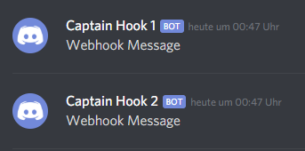
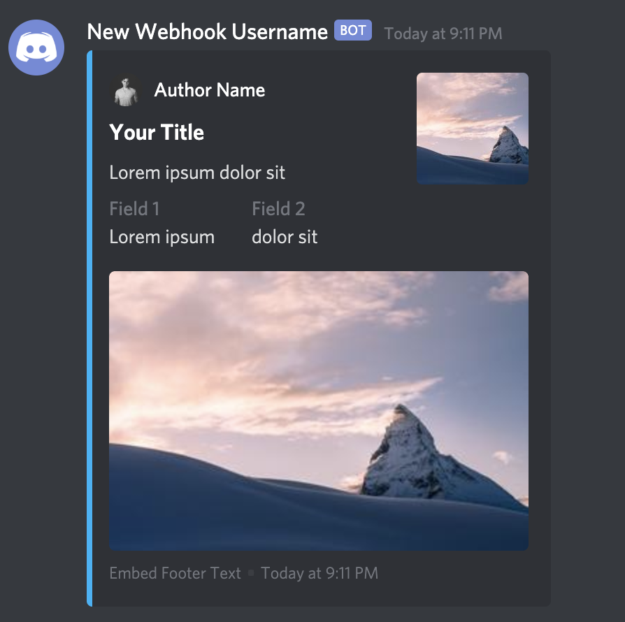
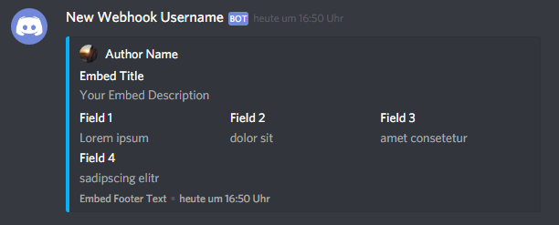
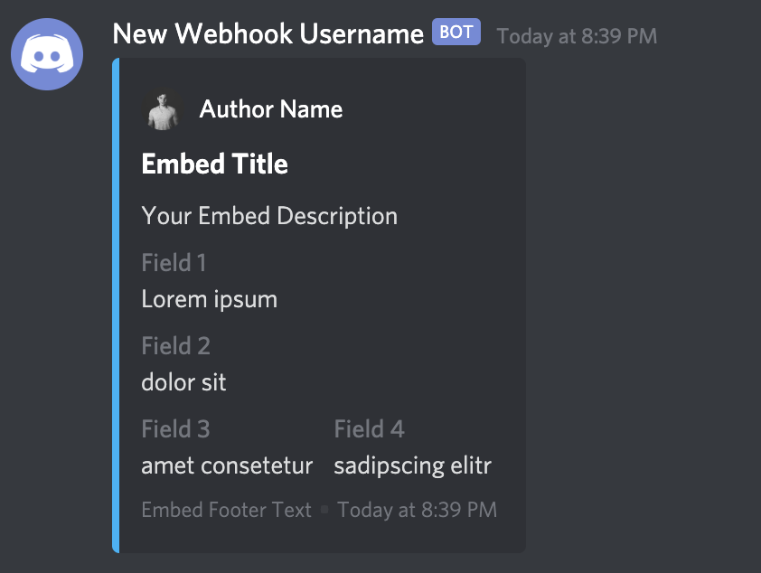
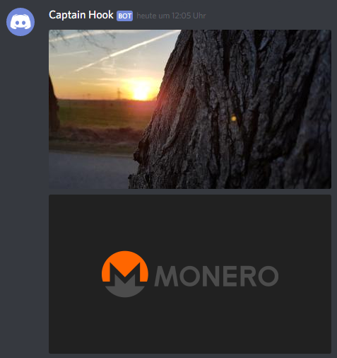

# python-discord-webhook

[](https://raw.githubusercontent.com/lovvskillz/python-discord-webhook/master/LICENSE)
[](https://badge.fury.io/py/discord-webhook)
[](https://pepy.tech/project/discord-webhook)

Execute Discord Webhooks (also has [async support](#async-support))

## Install

Install via pip:
```
pip install discord-webhook
```

## Examples

* [Basic Webhook](#basic-webhook)
* [Create Multiple Instances](#create-multiple-instances)
* [Manage Being Rate Limited](#manage-being-rate-limited)
* [Multiple Webhook Urls](#multiple-webhook-urls)
* [Embedded Content](#webhook-with-embedded-content)
* [Edit Webhook Message](#edit-webhook-messages)
* [Delete Webhook Message](#delete-webhook-messages)
* [Send Files](#send-files)
* [Remove Embeds and Files](#remove-embeds-and-files)
* [Allowed Mentions](#allowed-mentions)
* [Use Proxies](#use-proxies)
* [Timeout](#timeout)
* [Async Support](#async-support)

### Basic Webhook

```python
from discord_webhook import DiscordWebhook

webhook = DiscordWebhook(url='your webhook url', content='Webhook Message')
response = webhook.execute()
```

### Create multiple instances

```python
from discord_webhook import DiscordWebhook

# you can provide any kwargs except url
webhook1, webhook2 = DiscordWebhook.create_batch(urls=['first url', 'second url'], content='Webhook Message')
response1 = webhook1.execute()
response2 = webhook2.execute()
```

### Manage being Rate Limited

```python
from discord_webhook import DiscordWebhook

# if rate_limit_retry is True then in the event that you are being rate 
# limited by Discord your webhook will automatically be sent once the 
# rate limit has been lifted
webhook = DiscordWebhook(url='your webhook url', rate_limit_retry=True,
                         content='Webhook Message')
response = webhook.execute()
```


### Multiple Webhook URLs

```python
from discord_webhook import DiscordWebhook

webhook_urls = ['webhook url 1', 'webhook url 2']
webhook = DiscordWebhook(url=webhook_urls, content='Webhook Message')
response = webhook.execute()
```



### Webhook with Embedded Content

```python
from discord_webhook import DiscordWebhook, DiscordEmbed

webhook = DiscordWebhook(url='your webhook url')

# create embed object for webhook
# you can set the color as a decimal (color=242424) or hex (color='03b2f8') number
embed = DiscordEmbed(title='Your Title', description='Lorem ipsum dolor sit', color='03b2f8')

# add embed object to webhook
webhook.add_embed(embed)

response = webhook.execute()
```


```python
from discord_webhook import DiscordWebhook, DiscordEmbed

webhook = DiscordWebhook(url='your webhook url')

# create embed object for webhook
embed = DiscordEmbed(title='Your Title', description='Lorem ipsum dolor sit', color='03b2f8')

# set author
embed.set_author(name='Author Name', url='author url', icon_url='author icon url')

# set image
embed.set_image(url='your image url')

# set thumbnail
embed.set_thumbnail(url='your thumbnail url')

# set footer
embed.set_footer(text='Embed Footer Text', icon_url='URL of icon')

# set timestamp (default is now)
embed.set_timestamp()

# add fields to embed
embed.add_embed_field(name='Field 1', value='Lorem ipsum')
embed.add_embed_field(name='Field 2', value='dolor sit')

# add embed object to webhook
webhook.add_embed(embed)

response = webhook.execute()
```



This is another example with embedded content

```python
from discord_webhook import DiscordWebhook, DiscordEmbed

webhook = DiscordWebhook(url='your webhook url', username="New Webhook Username")

embed = DiscordEmbed(title='Embed Title', description='Your Embed Description', color='03b2f8')
embed.set_author(name='Author Name', url='https://github.com/lovvskillz', icon_url='https://avatars0.githubusercontent.com/u/14542790')
embed.set_footer(text='Embed Footer Text')
embed.set_timestamp()
embed.add_embed_field(name='Field 1', value='Lorem ipsum')
embed.add_embed_field(name='Field 2', value='dolor sit')
embed.add_embed_field(name='Field 3', value='amet consetetur')
embed.add_embed_field(name='Field 4', value='sadipscing elitr')

webhook.add_embed(embed)
response = webhook.execute()
```



By Default, the Embed fields are placed side by side. We can arrange them in a new line by setting `inline=False` as follows:

```python
from discord_webhook import DiscordWebhook, DiscordEmbed

webhook = DiscordWebhook(url="your webhook url", username="New Webhook Username")

embed = DiscordEmbed(
    title="Embed Title", description="Your Embed Description", color='03b2f8'
)
embed.set_author(
    name="Author Name",
    url="https://github.com/lovvskillz",
    icon_url="https://avatars0.githubusercontent.com/u/14542790",
)
embed.set_footer(text="Embed Footer Text")
embed.set_timestamp()
# Set `inline=False` for the embed field to occupy the whole line
embed.add_embed_field(name="Field 1", value="Lorem ipsum", inline=False)
embed.add_embed_field(name="Field 2", value="dolor sit", inline=False)
embed.add_embed_field(name="Field 3", value="amet consetetur")
embed.add_embed_field(name="Field 4", value="sadipscing elitr")

webhook.add_embed(embed)
response = webhook.execute()
```



### Edit Webhook Messages

```python
from discord_webhook import DiscordWebhook
from time import sleep

webhook = DiscordWebhook(url='your webhook url', content='Webhook content before edit')
webhook.execute()
webhook.content = 'After Edit'
sleep(10)
webhook.edit()
```

### Delete Webhook Messages

```python
from discord_webhook import DiscordWebhook
from time import sleep

webhook = DiscordWebhook(url='your webhook url', content='Webhook Content')
webhook.execute()
sleep(10)
webhook.delete()
```

### Send Files

```python
from discord_webhook import DiscordWebhook

webhook = DiscordWebhook(url='your webhook url', username="Webhook with files")

# send two images
with open("path/to/first/image.jpg", "rb") as f:
    webhook.add_file(file=f.read(), filename='example.jpg')
with open("path/to/second/image.jpg", "rb") as f:
    webhook.add_file(file=f.read(), filename='example2.jpg')

response = webhook.execute()
```



You can use uploaded attachments in Embeds:

```python
from discord_webhook import DiscordWebhook, DiscordEmbed

webhook = DiscordWebhook(url='your webhook url')

with open("path/to/image.jpg", "rb") as f:
    webhook.add_file(file=f.read(), filename='example.jpg')

embed = DiscordEmbed(title='Embed Title', description='Your Embed Description', color='03b2f8')
embed.set_thumbnail(url='attachment://example.jpg')

webhook.add_embed(embed)
response = webhook.execute()
```

### Remove Embeds and Files

```python
from discord_webhook import DiscordWebhook, DiscordEmbed

webhook = DiscordWebhook(url='your webhook url')

with open("path/to/image.jpg", "rb") as f:
    webhook.add_file(file=f.read(), filename='example.jpg')

embed = DiscordEmbed(title='Embed Title', description='Your Embed Description', color='03b2f8')
embed.set_thumbnail(url='attachment://example.jpg')

webhook.add_embed(embed)
response = webhook.execute(remove_embeds=True, remove_files=True)
# webhook.files and webhook.embeds will be empty after webhook is executed
# You could also manually call the functions webhook.remove_files() and webhook.remove_embeds()
```

`.remove_file()` removes the given file

```python
from discord_webhook import DiscordWebhook

webhook = DiscordWebhook(url='your webhook url', username="Webhook with files")

# send two images
with open("path/to/first/image.jpg", "rb") as f:
    webhook.add_file(file=f.read(), filename='example.jpg')
with open("path/to/second/image.jpg", "rb") as f:
    webhook.add_file(file=f.read(), filename='example2.jpg')
# remove 'example.jpg'
webhook.remove_file('example.jpg')
# only 'example2.jpg' is sent to the webhook
response = webhook.execute()
```

### Allowed Mentions

Look into the [Discord Docs](https://discord.com/developers/docs/resources/channel#allowed-mentions-object) for examples and for more explanation

This example would only ping user `123` and `124` but not everyone else.

```python
from discord_webhook import DiscordWebhook

content = "@everyone say hello to our new friends <@123> and <@124>"
allowed_mentions = {
    "users": ["123", "124"]
}

webhook = DiscordWebhook(url='your webhook url', content=content, allowed_mentions=allowed_mentions)
response = webhook.execute()
```

### Use Proxies

```python
from discord_webhook import DiscordWebhook

proxies = {
  'http': 'http://10.10.1.10:3128',
  'https': 'http://10.10.1.10:1080',
}
webhook = DiscordWebhook(url='your webhook url', content='Webhook Message', proxies=proxies)
response = webhook.execute()
```
or
```python
from discord_webhook import DiscordWebhook

proxies = {
  'http': 'http://10.10.1.10:3128',
  'https': 'http://10.10.1.10:1080',
}
webhook = DiscordWebhook(url='your webhook url', content='Webhook Message')
webhook.set_proxies(proxies)
response = webhook.execute()
```

### Use CLI

```
usage: discord_webhook [-h] -u URL [URL ...] -c CONTENT [--username USERNAME]
                       [--avatar_url AVATAR_URL]

Trigger discord webhook(s).

optional arguments:
  -h, --help            show this help message and exit
  -u URL [URL ...], --url URL [URL ...]
                        Webhook(s) url(s)
  -c CONTENT, --content CONTENT
                        Message content
  --username USERNAME   override the default username of the webhook
  --avatar_url AVATAR_URL
                        override the default avatar of the webhook
```

### Timeout

```python
from requests.exceptions import Timeout
from discord_webhook import DiscordWebhook, DiscordEmbed

# We will set ridiculously low timeout threshold for testing purposes
webhook = DiscordWebhook(url='your webhook url', timeout=0.1)

# You can also set timeout later using
# webhook.timeout = 0.1

embed = DiscordEmbed(title='Embed Title', description='Your Embed Description', color='03b2f8')

webhook.add_embed(embed)

# Handle timeout exception
try:
    response = webhook.execute()
except Timeout as err:
    print(f'Oops! Connection to Discord timed out: {err}')
```

### Async support
In order to use the async version, you need to install the package using:
```
pip install discord-webhook[async]
```
Example usage:
```python
import asyncio
from discord_webhook import AsyncDiscordWebhook


async def send_webhook(message):
    webhook = AsyncDiscordWebhook(url='your webhook url', content=message)
    await webhook.execute()


async def main():
    await asyncio.gather(
        send_webhook('Async webhook message 1'),
        send_webhook('Async webhook message 2'),
    )  # sends both messages asynchronously


asyncio.run(main())
```

## Development

### Dev Setup
This project uses [Poetry](https://python-poetry.org/docs/) for dependency management and packaging.

Install Poetry and add Poetry to [Path](https://python-poetry.org/docs/#installation).

**Debian / Ubuntu / Mac**

`curl -sSL https://install.python-poetry.org | python3 -`

**Windows**

open powershell and run: `(Invoke-WebRequest -Uri https://install.python-poetry.org -UseBasicParsing).Content | py -`

Install dependencies: `poetry install`

Install the defined pre-commit hooks: `poetry run pre-commit install`

Activate the virtualenv: `poetry shell`